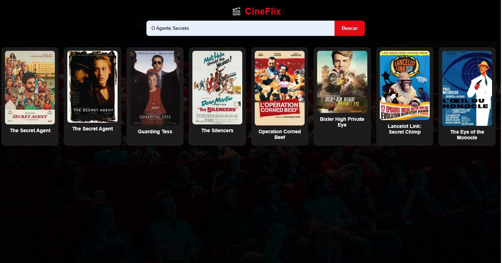

# 🎬 CineFlix

Aplicação web simples e responsiva para busca de filmes, consumindo uma API pública e exibindo resultados em tempo real.

🔗 **Acesse o projeto:** https://juvalent.github.io/CineFlix/

---

## 📸 Preview

---

## 🚀 Funcionalidades

- 🔎 Busca de filmes por nome
- 🔎 Busca de filmes por voz (recurso de Hardware)
- 🎞️ Exibição de pôster e título
- 📱 Layout responsivo (mobile-first)
- ⚡ Consumo de API em tempo real

---

## 🛠️ Tecnologias utilizadas

- HTML5  
- CSS3  
- JavaScript  
- API pública de filmes  

---

## 📂 Estrutura do projeto

CineFlix/
│
├── index.html
├── manifest.json
├── style.css
├── script.js
├── service-worker.js
└── print.png

---

## 🎯 Objetivo

Este projeto foi desenvolvido como desafio prático da aula de coding mobile para consolidar conhecimentos em consumo de APIs, manipulação de DOM e desenvolvimento de interfaces responsivas e recurso de Hardware.

---

## 💡 Aprendizados

- Integração com APIs externas  
- Manipulação dinâmica de elementos HTML  
- Responsividade com CSS
   

